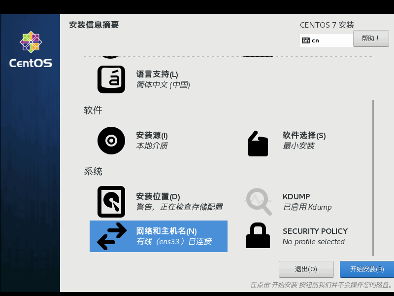

# <center> CENTOS8 系统安装 </center>


## 准备
- Centos8 引导U盘
- 可能需要的服务器引导光盘
- 若系统将安装在尚未初始化的整列盘，则先初始化阵列


## 安装引导

- 以 Centos U盘安装盘引导
- 方向键选择第一项 `install CentOS8` 回车


## 欢迎界面

  
- 输入 `chin` 筛选出中文，然后选择 `简体中文（中国）`


## 信息收集界面

- 等待灰色检测项目完成
 
    

    

- 软件/软件选择 保持 最小安装 不变。可点击进入选择安装部件
- 点击进入 `系统-安装位置`
- 在 `本地标准磁盘` 可能会有多个磁盘，勾选一个作为系统安装盘，记住磁盘名称（比如 `sda` ） **此物理盘所有数据后续将会被删除**
- **记下选中系统盘名 比如 `sda`**
- `其他存储选项` 中选择 `我要配置分区`

    

- 点击 `完成` 按钮


## 手动分区

### 1. 系统磁盘分区规划准则
  1. 大于 2T 磁盘必须使用 `GPT` 分区格式，且必须使用 `parted` 命令而非 `fdisk`
  2. 独立**分区**挂载 `/boot` 用于当 `LVM` 卷异常时可引导系统
  3. 剩余空间使用 `LVM` **逻辑卷**管理器进行管理，在 `ViturlGroup` 基础上划分逻辑卷（`ViturlVolume`）挂载各加载点
  4. 划分 50G `LV` 逻辑卷用于挂载根 `/` 
  5. 根据空间及应用划分逻辑卷用于挂载系统日志 `/var/log`，避免日志吃完磁盘空间导致应用异常以及无法 `ssh` 登录进行维护操作。本例划分 30G 空间
  6. 划分 8G `LV` 逻辑卷用于挂载交换分区 `swap` 
  7. `VG` 剩余空间中 `95%` 创建 `LV` 逻辑卷挂载 `/data`， 用于存放生产数据
  8. 不建议独立卷挂载 `/home`
  9. 所有普通分区（不包含 `swap` `biosboot` 等）采用 `mkfs.xfs` 命令格式化为 `xfs` 文件格式，方便结合 `LVM` 进行文件系统在线动态扩展
  10. 外部存储卷建议不在 `/etc/fstab` 中挂载，而是在 `/etc/rc.local` 中通过 `mount` 命令挂载。避免外部存储卷异常导致系统无法启动

### 2. 安装目标位置界面

    

  - 键盘快捷 `Ctrl-Alt-F2` 组合键进入控制台
  - 确定系统安装目标磁盘
  - 执行命令, `nvme0n1` 为设备名
    ```sh
    parted /dev/nvme0n1 p
    ```
    结果应该如下  

      

  - 若此磁盘已有分区则首先删除所有分区
    ```sh
    parted -s /dev/nvme0n1 rm 0 rm 1 rm 2
    ```

### 3. 创建 `ESP`, `boot` 核心启动分区

**注意： `nvme0n1` 名称为上方系统盘安装盘的设备名称，切勿弄错**

1. 设置 GPT 引导格式
   ```sh
   parted /dev/nvme0n1 -s mklabel gpt 
   ```
2. 创建 `biosboot` 引导分区（可选）  
   若系统磁盘采用 `GPT` 分区表，系统引导为 `BIOS` 而非最新的 `UEFI`，或者在 VMWARE 虚拟机中安装系统，则需要额外的引导分区  

   **如果划分了此分区，则后续操作分区序号都需要+1**
   ```sh
   parted /dev/nvme0n1 -s mkpart Grub 1M 10M 
   parted /dev/nvme0n1 -s set 1 bios_grub on
   ```
3. 创建 UEFI 引导分区
   ```sh
   parted /dev/nvme0n1 -s mkpart EFI fat32 1M 200M set 1 boot on
   mkfs.fat -F 32 /dev/nvme0n1p1
   ```
     
3. 创建 `boot` 启动分区

   **注意： `sda` 名称为上方系统盘安装盘的设备名称，切勿弄错**
   ```sh

   parted /dev/nvme0n1 -s mkpart boot xfs 200M 700M
   mkfs.xfs /dev/nvme0n1p2
   ```

### 系统盘剩余空间由 `LVM` 管理

- 划分系统盘剩余空间分区
  ```sh
  parted /dev/nvme0n1 -s mkpart LVM 700M 90%
  ```

- 查看系统盘分区情况
  ```sh
  parted /dev/nvme0n1 p
  ```
    


### 创建 `LVM` 物理卷、卷组

- 创建 `PV` 物理卷

  **nvme0n1p3 数字 3 为 LVM 分区 Number 序列号. 切勿弄错**
  ```sh
  pvcreate /dev/nvme0n1p3
  ```
  结果应该如下  

    

- 创建 `VG` 卷组

  执行命令
  ```sh
  vgcreate vg0 -s 100M /dev/nvme0n1p3
  ```
  - `100M` 为 `PE` 块大小
  - `vg0` 为 `VG` 卷组名 以后的访问路径将会为 `/dev/vg0/`

  执行命令
  ```sh
  vgs
  vgdisplay vg0
  ```

  结果应该如下  

    


### 创建 `LV` 逻辑卷并**格式化**

注意区分容量参数 `-L` 单位是字节，`-l` 单位是百分比 

- swap 交换卷
  ```sh
  lvcreate vg0 -n swap -L 8G
  mkswap /dev/vg0/swap
  swapon /dev/vg0/swap
  ```
  结果应该如下  

    


- root 卷
  ```sh
  lvcreate vg0 -n root -L 50G
  mkfs.xfs /dev/vg0/root
  ```
  结果应该如下  

    
- log 卷

  此逻辑卷将会挂载为 `/var/log` 系统日志目录。
  可根据业务需求及磁盘空间增减分配空间
  ```sh
  lvcreate vg0 -n log -L 20G
  mkfs.xfs /dev/vg0/log
  ```
- 数据卷 `/data`
  ```sh
  lvcreate vg0 -n data -l 95%FREE
  mkfs.xfs /dev/vg0/data
  ```
  - `-l 95%FREE` 表示使用 `VG` 组 （此处为 `vg0`）剩余空间中 `95%` 百分比容量创建
  - 格式化分区命令 `ftype=1` 参数必须

  确认 `ftype=1` 信息  

    

  若 `ftype=0` 则重新格式化
  ```sh
  mkfs.xfs -f -n ftype=1 /dev/vg0/data
  ```
- 查看 `LV` 逻辑卷列表
  ```sh
  lvs
  ```

    


## 挂载逻辑卷

- 键盘快捷 `Ctrl-Alt-F6` 组合键返回图形界面
- 点击 `完成` 按钮进入手动分区界面然后点击刷新按钮 更新扫描磁盘分区

    
    
    

- 退回到安装目标位置界面后重新点击 `完成` 按钮重新进入

    
    
  若创建了 biosboot 分区则  
    


- 挂载启动分区 `/boot`

    

- 挂载 `/data`

    

- 挂载系统日志 `/var/log` 

    


- 挂载根 `/`

  必须选中 `重新格式化`

    

- 挂载其他卷（可选）

- 查验挂载点

    

- 点击 `完成` 按钮 在弹出框内确认无误后点击 `接受更改` 按钮 回到 `安装信息摘要` 界面

    
    


## 配置网络

**若不在此安装过程中配置网络，则安装结束后系统将不会启用网络功能**

- 点击 `网络和主机名` 进入界面， 打开网卡

    

- 可点击 `配置` 按钮对网络进行高级配置
- 可在 `主机名` 输入框输入主机名 然后点击 `应用` 按钮
- 点击 `完成` 按钮退出


## 开始安装

- 点击 `开始安装` 按钮

    
    

- 设置 root 密码

    

- 安装完成，点击 `重启` 按钮 重启系统

    

- 启动界面

    

- 登录界面 使用 root 账户登录系统
  ```sh
  df -hT
  ```
    


