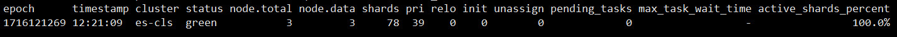

# Elastic Search

```sh
cd /data/.docker/volumes/elasticsearch_certs/_data
export esuser=elastic
export espass=abc123 
```

## 查看健康信息

```sh
curl -u $esuser:$espass --cacert ca/ca.crt https://localhost:9200/_cat/health?v
```
响应


## 查询状态

```sh
curl -u $esuser:$espass --cacert ca/ca.crt https://localhost:9200
```
响应
```json
{
  "name" : "es01",
  "cluster_name" : "es-cls",
  "cluster_uuid" : "fN7IuKXqSWyEGizlEebNUA",
  "version" : {
    "number" : "8.13.4",
    "build_flavor" : "default",
    "build_type" : "docker",
    "build_hash" : "da95df118650b55a500dcc181889ac35c6d8da7c",
    "build_date" : "2024-05-06T22:04:45.107454559Z",
    "build_snapshot" : false,
    "lucene_version" : "9.10.0",
    "minimum_wire_compatibility_version" : "7.17.0",
    "minimum_index_compatibility_version" : "7.0.0"
  },
  "tagline" : "You Know, for Search"
}
```

## 查看节点信息
```sh
curl -u $esuser:$espass --cacert ca/ca.crt https://localhost:9200/_cat/nodes
```
响应
```
172.18.0.4 22 92 17 1.14 1.03 1.10 cdfhilmrstw * es02
172.18.0.5 73 89 17 1.14 1.03 1.10 cdfhilmrstw - es03
172.18.0.3 61 87 17 1.14 1.03 1.10 cdfhilmrstw - es01
```

## 查看完整信息
```sh
curl -u $esuser:$espass --cacert ca/ca.crt http://localhost:9200/_nodes?pretty
```